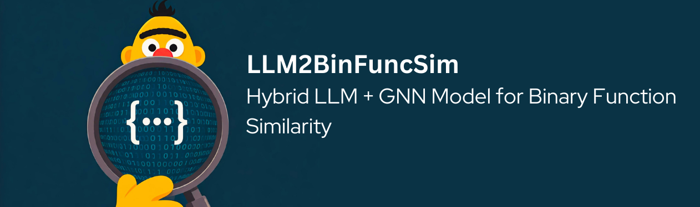

## LLM2BinFuncSim: Hybrid LLM + GNN Model for Binary Function Similarity

[](https://www.python.org/downloads/release/python-3109/)  [](https://pre-commit.com/) <a href="https://github.com/psf/black"></a>

### About

This repository implements a hybrid approach using Large Language Models (LLMs) and Graph Neural Networks (GNNs) to tackle the binary function similarity problem in cybersecurity.

### Step 0: Preparations
Run the following command to prepare the development environment

```bash
poetry install --no-root
bash bootstrap.sh
```

### Step 1: Graph Dataset Generation

The first step involves generating a graph dataset from existing cybersecurity function datasets used in previous works. You'll find sample code for this step in `generate_graph_dataset.py`.

To generate the graph dataset, execute the following commands:

```bash
python preprocess/generate_graph_dataset.py
python preprocess/filter_graph_dataset.py
```

### Step 2: Training

The training step can be divided in two phases LLM pretraining and then also the GNN training.

#### Step 2a LLM training
For the first one we can choose to first domain adapt the LLM and the pretrain the LLM in a supervised contrastive training fashion running the example scripts presents in the `examples` folder. Also to extract the CLS from the pretrained model.

#### Step 2b GNN training
In this part you have to provide the node embeddings extracted in the previous step for each dataset split to the GNN, in order to achieve this run the following commands in the project root directory:

```bash
# move the extracted embeddings in a new folder inside the HermesSim directory
mkdir -p ./HermesSim/inputs/acfg_llm
mv <embeddings_path> !$

cd ./HermesSim
# adapt them in their format 
bash preprocess/preprocess_all.sh
python model/main.py --inputdir dbs --config ./model/configures/llm.json --dataset=one
```  

### Step 3: Evaluation

For the evaluation step refers to the previous work
